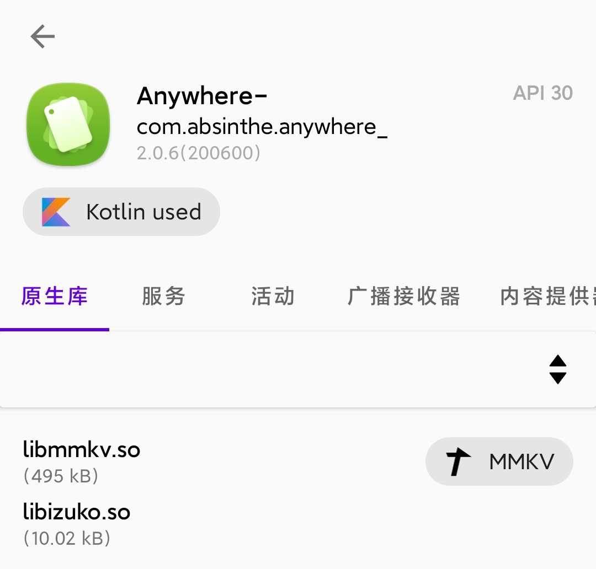
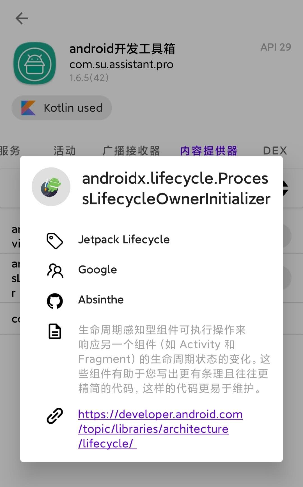
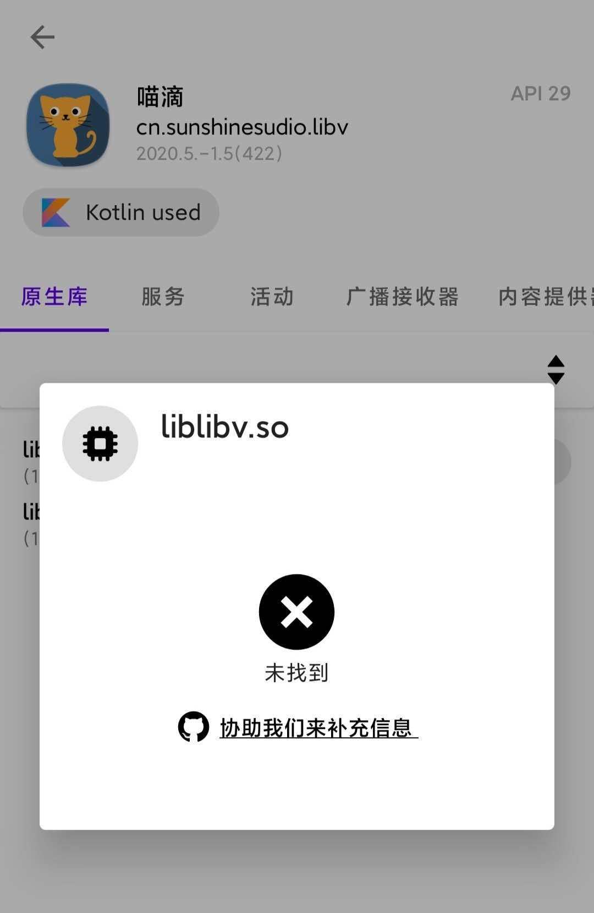

# 知名库标记

## 简介

LibChecker 目前的标记库由主程序本地定义 + 规则仓库云端定义共同实现。在浏览 App 的组件列表时，如果组件名称匹配本地内置规则，则会在项目右侧显示该库的徽标。轻击列表项即可呼出库详情弹窗。

弹窗内依次展示了 库名称、开发团队、规则贡献者、简介和相关链接。如果没有匹配到云端规则则会出现以下情形。

这时您可以选择点击弹窗中间的 **协助我们来补充信息**，规则将会以 GitHub issue 的形式被提交，您可能需要一个 GitHub 账户。当然，您也可以直接访问 [LibChecker-Rules](https://github.com/zhaobozhen/LibChecker-Rules) 规则仓库来提交 issue，注意需要按照模板形式提交。

::: tip 提示
LibChecker 会检测设备与云端仓库的连通性，只有可以正常访问云端仓库才可以开启库详情弹窗，因此建议您保持网络通畅。国内网络建议选择 Gitee 仓库，国外网络建议选择 GitHub 仓库。
:::