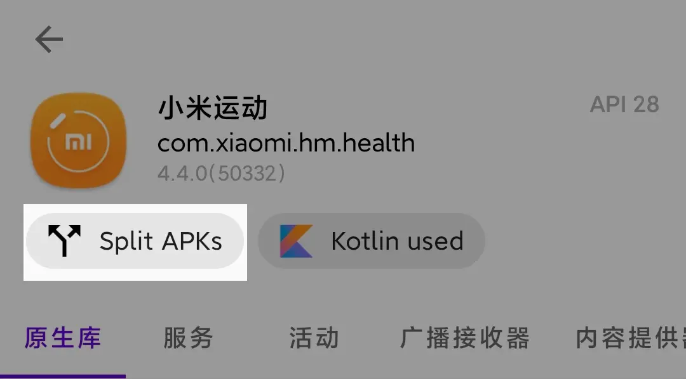
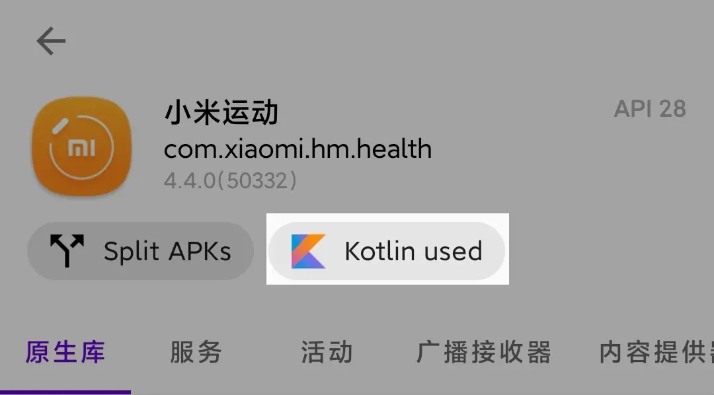

# 包特性分析

嘿！Android 的安装包（APK）文件中存在着大量的文件，我们也许可以从中发现点什么。

## Split APKs

LibChecker 可以检测安装包是否为 Google Play 分发的 AAB 安装包，详情请参考 [Android App Bundle 简介](https://developer.android.com/guide/app-bundle)。

## Kotlin

LibChecker 可以检测 App 是否使用了 Kotlin 编程语言。

::: warning 注意
安装包包含 Kotlin 内容不完全意味着 App 使用了 Kotlin 编写，也有可能是 App 引入了使用 Kotlin 编写的三方库。
:::