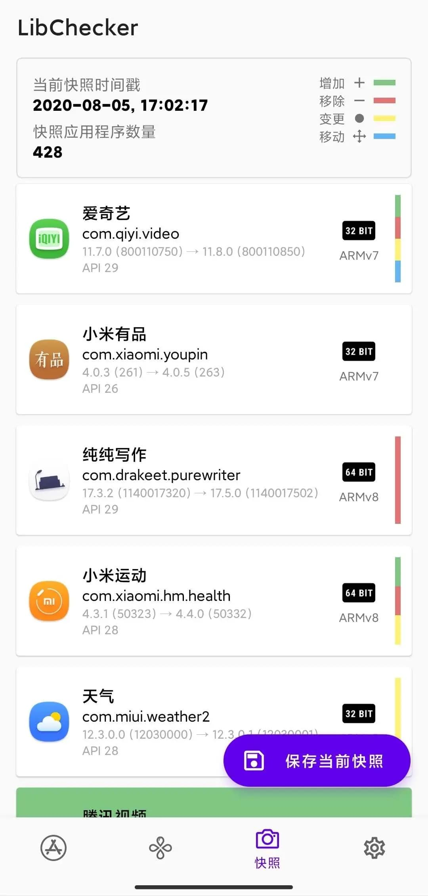
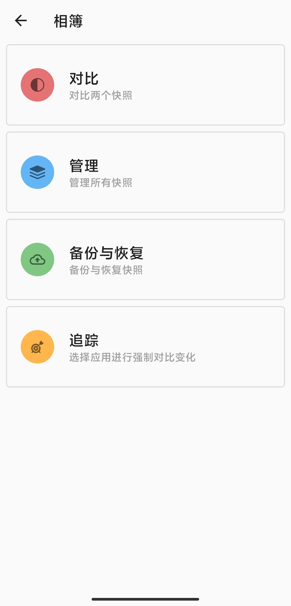
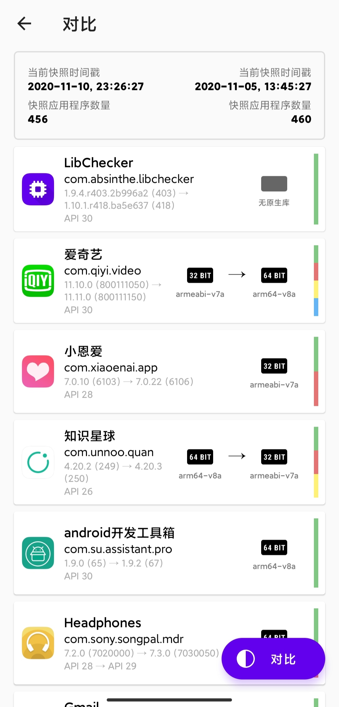

# 快照

## 什么是快照？

小时候我很喜欢看一部日本动画，主角收集到了各种各样的卡牌，其中有一张牌名为 **時（タイム）** ，它可以让时间暂停，让我印象很深刻，这也是快照功能的灵感来源。快照功能的思路来自 VCS（版本控制系统），您可以查看 App 更新前后的任意组件变化。

## 使用方法

第一次进入快照页面时列表是空白的，这时您可以点击主页右下角的 **保存当前快照** 按钮，随后等待一段时间。保存成功后在页面上方会显示当前快照的时间戳。此时列表仍然为空，不用疑惑，去更新应用吧！回来会看到惊喜。

 

## 仪表盘区功能

快照页面的上方有着显示时间戳和快照应用数量的仪表盘，现在它可以点击进入，进行一些进阶操作。

### 对比
得益于对多副本快照的支持，LibChecker 现在可以进行两个快照之间的比较。

在上方仪表盘选择两个不同的快照，然后点击右下角的“比较”，就这么简单。现在你可以比较任意两个时间点的应用变更了！

### 管理

管理功能用于删除已有的快照，未来会加入更多的功能。

### 备份与恢复

备份与恢复功能提供了简单的快照备份与恢复，目前只能选择备份和恢复全部快照，未来将会提供选择任意快照备份的功能。

::: warning 警告
备份功能使用 SAF 框架实现，其依赖系统中的 **文件(com.google.android.documentsui)** 应用。请确保你的 ROM 中包含此应用并可正常工作。如果你的 ROM 不能正常工作，请联系你的设备制造商。
:::

### 追踪

追踪功能用于强制对比处于追踪列表中的应用。由于性能方面的考虑，LibChecker 基于以下条件对快照项进行对比：

* 新的 App 的 versionCode > 旧的 App 的 versionCode
* 新的 App 的 lastUpdateTime > 旧的 App 的 lastUpdateTime
* App 存在于追踪列表中

对于一些系统预装应用来说，其 versionCode 和 lastUpdateTime 可能不会发生变化，此时您可以将此 App 加入到追踪列表中。