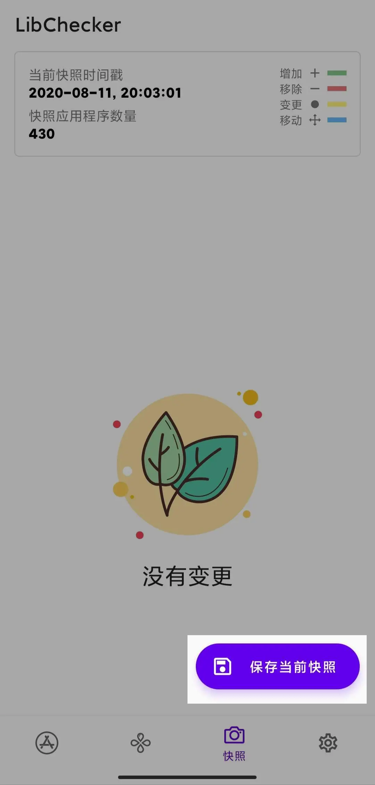

# 快照

## 什么是快照？

小时候我很喜欢看一部日本动画，主角收集到了各种各样的卡牌，其中有一张牌名为 **時（タイム）** ，它可以让时间暂停，让我印象很深刻，这也是快照功能的灵感来源。快照功能的思路来自 VCS（版本控制系统），您可以查看 App 更新前后的任意组件变化。

## 使用方法

第一次进入快照页面时列表是空白的，这时您可以点击主页右下角的 **保存当前快照** 按钮，随后等待一段时间。保存成功后在页面上方会显示当前快照的时间戳。此时列表仍然为空，不用疑惑，去更新应用吧！回来会看到惊喜。

 