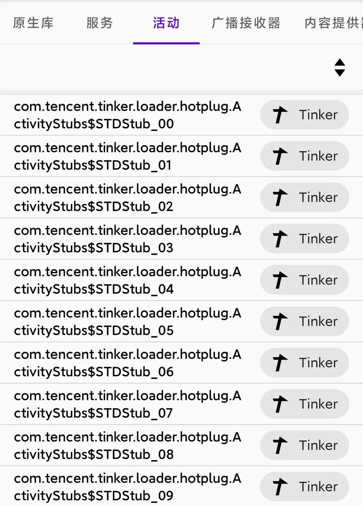

# 什么是注册组件？

## 基础知识

注册组件，即人们常说的“四大组件”，包括：

- 服务（Service）
- 活动（Activity）
- 广播接收器（Broadcast Receiver）
- 内容提供器（Content Provider）

它们被静态声明在 APK 的 AndroidManifest.xml 文件中，随 App 安装被注册在系统中。下面简要介绍它们各自的用途。

- **服务：** 可用于在后台执行耗时操作，另外它也用于进程间通信（IPC）
- **活动：** 用于显示界面来与用户交互，四大组件中唯一用户可感知的组件
- **广播接收器：** 可进行通知操作，例如用户熟悉的 App 自启动，本质是注册了系统的开机广播，系统开机后发送开机广播，App 被拉起
- **内容提供器：** 跨进程提供数据，包括但不限于应用数据库中的数据

一些基于 **Intent 防火墙（IFW）** 或 **包管理器（PM）** 处理方式的 App 可以做到禁用以上的 **静态注册** 的组件。

::: danger 警告
随意禁用注册组件是一项危险的操作，最好的情况是相关功能无法使用。如果 App 的开发者没有做良好的容错处理，将很可能导致 App 闪退、数据丢失。
:::

::: warning 注意
广播接收器可以被 **动态注册**，即 App 可能存在很多不为用户所知的广播被启动 App 后注册，这些广播是无法被知晓和禁用的。
:::

::: warning 注意
App 可以在应用启动的过程中 **动态注册** 四大组件，因此存在某一组件被禁用后启动 App 又重新被启用的情况。
:::

## 为什么我的 App 中有这些奇怪的组件？

很多 App 中会有上图这种重复的活动，这种一般是引入了热更新 SDK。每一个活动只是一个“占位符”，由云端动态注册成为实体活动。